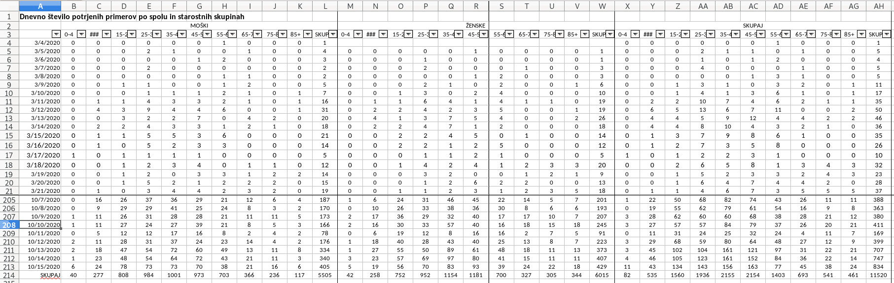

EPI parsing script
----

# Before you start
Make sure you have all the project requirements installed. It would be advisible to use some sort of virtual
environment. My program of choice is `virtualenvwrapper`
 
```
mkvirtualenv sledilnik --python=python3.8
workon sledilnik

pip install -r requirements.txt
```

# Running the script
To run an EPI table4 parsing script, you can do so from Python or command line. To get help on the script arguments
and other useful information (including on how to run it), run

```
python parse_tb4.py --help
```

## Python

```python
from epi.epi_functions import dump_epi_tb4

dump_epi_tb4(datum="2020-11-01")
```

This will create a new dump file with cumulative sums in the same folder as data folder (`data_loc`).

If you already have a dump file (from a previous day), specify `original_csv`.

If you run the script without any arguments, it will assume current date and will search for yesterday's input file
. If file from previous run (`age-confirmed.csv`) exists, it will use it to create a diff.

```python
from epi.epi_functions import dump_epi_tb4

dump_epi_tb4(datum="2020-11-01", original_csv="age-confirmed.csv")
```

and you should also get a diff file between current datum and one specified in `original_csv`.

## Command line
Make sure you have all the requirements installed. You may need to specify where the data is located if not in the
same folder as the script.
 
```
python parse_tb4.py 2020-11-01 --original-csv=age-confirmed.csv --data-loc=./files
```

which would assume the data files are located in a subfolder called `files/`.

# Data
Data should come in the form of approximately `POROCILO_STEVILO POTRJENIH PRIMEROV COVID-19_15102020.xlsx`. The key
part here is the last part of "datum" (day-month-year). There should be only one file per date. If more, an error
will be raised.

The figure below shows the structure of the data for which this script was created.



# Testing
To run the tests, go to `sledilnik-data/` and run

```
python -m unittest
```

# Misc
Script `running.py` is there for testing purposes, feel free to ignore it.